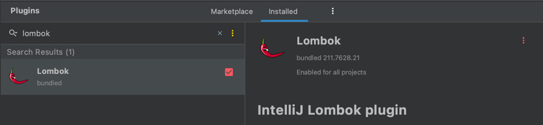
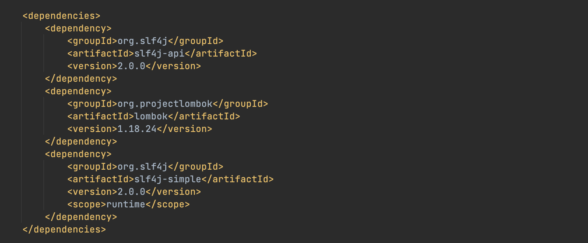

# AOS - Acus Operating System

- Project link (GitHub) : https://github.com/phamgiaphuc/AcusOperatingSystem
- Project's author: Pham Gia Phuc - Acus
- Personal profile: https://github.com/phamgiaphuc
- Contact email: acuscodinghcm@gmail.com

### Languages, tools and topics in this project:

1. **[Java](https://www.java.com/en/download/help/whatis_java.html)** (Back-end language)
2. **[JavaFX](https://openjfx.io/) & [CSS](https://www.w3schools.com/css/css_intro.asp)** (Front-end language)
3. **[Maven](https://maven.apache.org/)** (Software project management)
4. **[PostgreSQL](https://www.postgresql.org/)** (Database)
5. **[Docker](https://www.docker.com/)**
6. **[Lombok](https://projectlombok.org/)** (Java library)

-----------------------------------
<ins>

### USER GUIDE

</ins>

### STEP 1: Download or clone the project to your computer

> **Project URL**: https://github.com/phamgiaphuc/AcusOperatingSystem

**Or**

```
git clone git@github.com:phamgiaphuc/AcusOperatingSystem.git
```

### STEP 2:  Before running program, you make sure your computer already installed tools below

- JDK version 18.0.2 or later.
- JFX version 18.0.2 or later.
- Maven version 4.0.0 or later.

> **Advice:** I recommend languages and tools version must be match in order to have full experience to run the program successfully.

- Check the **pom.xml** and **module-info.java** if the third library Lombok is already installed in the files

> **Notice:** If the library is not installed, check the **"Install third library guide"** section.

### STEP 2: Program is configured as follows

**2.1 When running the program, admins enter a sign-in stage**

<div align="center">
  
</div>

### STEP 3: Run the program

Click the file path below:

- To run the program, click [here](src/main/java/com/example/aos/InitApplication.java).

-----------------------------------

<ins>

### INSTALLING THIRD LIBRARY GUIDE

</ins>

> **Advice:** Please follow the steps below otherwise the program can not run.

#### 1. Lombok library

#### Step 1: Go to 'Preferences' then go to 'Plugins' and type 'lombok' to search. It will look like this



#### Step 2: Enable Lombok then press Apply and OK

#### Step 3: Go to the pom.xml file and add this code like in the picture

`code:`

```
    <!-- lombok library: https://projectlombok.org/ -->
    <dependency>
        <groupId>org.slf4j</groupId>
        <artifactId>slf4j-api</artifactId>
        <version>2.0.0</version>
    </dependency>
    <dependency>
        <groupId>org.projectlombok</groupId>
        <artifactId>lombok</artifactId>
        <version>1.18.24</version>
    </dependency>
    <dependency>
        <groupId>org.slf4j</groupId>
        <artifactId>slf4j-simple</artifactId>
        <version>2.0.0</version>
        <scope>runtime</scope>
    </dependency>
```

`picture:`



> **Notice:** Remember to **clean, compile and reload** the file again.


#### Step 4:

- Everytime you want to use the third library, just enter "@Slf4j" on the head of the class like this.

```java
    package ftp.client;
    
    import lombok.extern.slf4j.Slf4j;
    @Slf4j 
    public class ClientConnection {
        // Variables...
    }
```

#### Step 5: It's done. Check the configuration again and run the program

#### 2. PostgreSQL driver

#### Step 1: Add this code to the pom.xml file

`code:`

```
    <!-- https://mvnrepository.com/artifact/org.postgresql/postgresql -->
    <dependency>
        <groupId>org.postgresql</groupId>
        <artifactId>postgresql</artifactId>
        <version>42.5.0</version>
    </dependency>
```

#### Step 2: Clean, compile and reload the file again

#### Step 3: It's done. Check the configuration again and run the program
